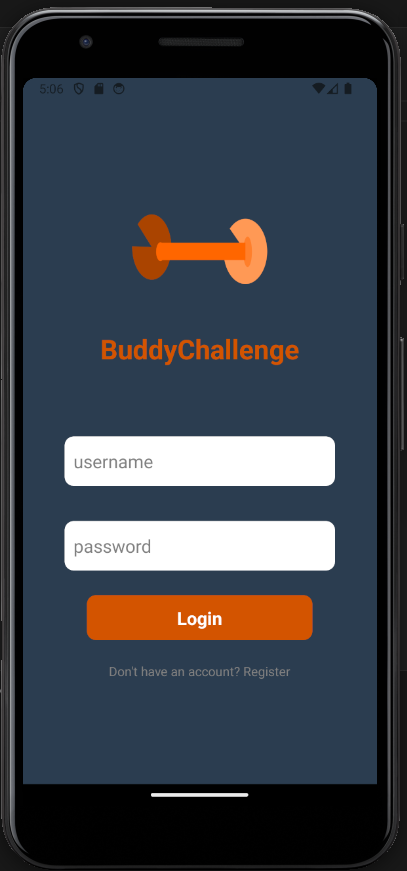
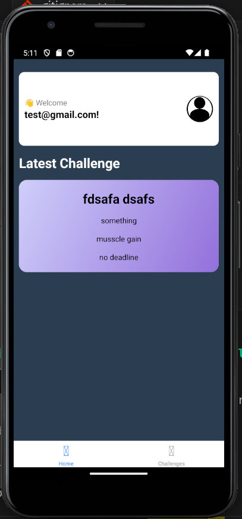

# 💪 App Buddy Challenge

A mobile application built with React Native that helps you create and participate in gym challenges with friends. Motivate each other, track progress, and achieve better results together!

> ⚠️ Note: This project is currently under active development.

## 📱 Screenshots

<div align="center">
  
  
</div>

## ✨ Features 

- Singup
- Login
- Main Screen (WIP)
- Create custom gym challenges (under development)
- Invite friends to participate (under development)
- Track progress in real-time (under development)
- Set personal and group goals (under development)
- Compare results with friends (under development)

## 🛠️ Tech Stack

- React Native
- Backend: [be-buddy-challenge](https://github.com/aaoeclipse/new-buddy-challenge-api)

## 🎨 Design

The UI/UX was carefully crafted in Figma to ensure an intuitive and engaging user experience. 
View the complete design documentation here: [Figma Design](https://www.figma.com/design/NKTvPCnyGDHfpcOy2ydV19/BuddyChallenge?node-id=0-1&t=FjjslYRiHr5B60f7-1)

## 🚀 Getting Started

1. Clone the repository
```bash
git clone https://github.com/aaoeclipse/app-buddy-challenge-native
```

Install dependencies

```bash
npm install
# or
yarn install
```

Start the development server

```bash
npm start
# or
yarn start
```
## 🤝 Contributing
Contributions are always welcome!

## 📞 Contact
You can contact me at my email santiago.paiz@gmail.com